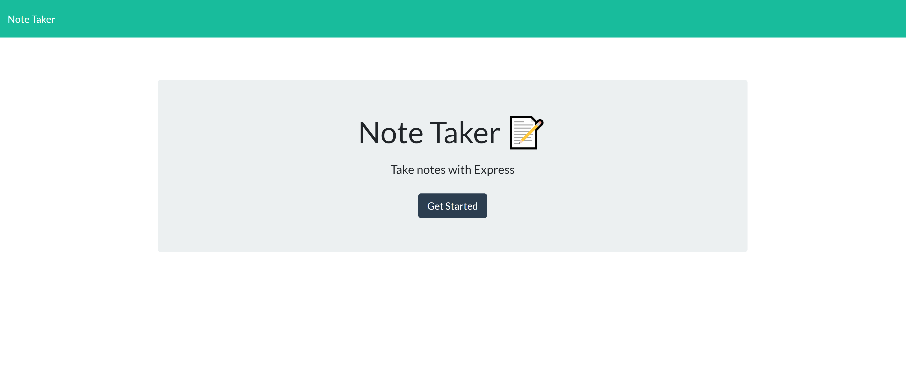
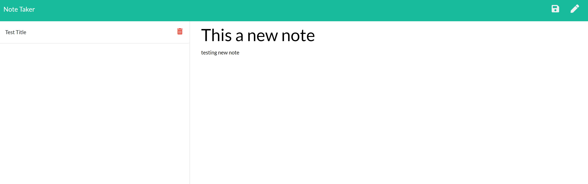
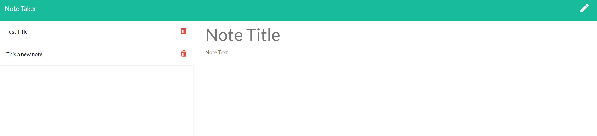

  ## Title
 du-Note-Taker

## Description
Will allow user to take notes, save notes, and delete notes. 

## Table of Contents
[Title](##Title)
[Description](##Description)
[Installations](##Installations)
[Usage](##Usage)
[License](##License)
[Contributing](##Contributing)
[Questions](##Questions)

## Installations
npm i

## Usage
N/A

## Contributing
Contact me

## Tests
To run tests run the following command:

npm test

## Questions
If you have any questions contact me at mrivera0014@gmail.com.
Find more of my work at (https://github.com/mrivera0014/)

[https://guarded-tundra-91066.herokuapp.com/](https://guarded-tundra-91066.herokuapp.com/)

